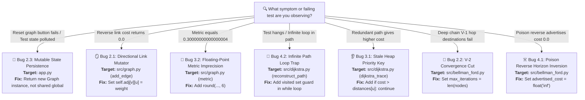

# ForkThis Master Bug Inventory & Solution Guide

This document tracks all intentional bugs injected for the **ForkThis** event, including location, symptoms, failure behavior, difficulty ratings, and exact solutions.

### 🗺️ Visual Diagnostic Flowchart



---

### 📊 Bug Difficulty Ranking Table

#### 🟢 Currently Injected Bugs (7 Active in Project)
| Bug ID & Name | File Target | Difficulty Rating | Status |
| :--- | :--- | :--- | :--- |
| **Bug 2.2: V-2 Convergence Cut** | `src/bellman_ford.py` | Easy ⭐ | 🔴 Active |
| **Bug 2.1: Directional Link Mutator** | `src/graph.py` | Easy ⭐⭐ | 🔴 Active |
| **Bug 3.1: Stale Heap Priority Key** | `src/dijkstra.py` | Medium ⭐⭐⭐ | 🔴 Active |
| **Bug 4.1: Poison Reverse Horizon Inversion** | `src/bellman_ford.py` | Medium ⭐⭐⭐ | 🔴 Active |
| **Bug 4.2: Infinite Path Loop Trap** | `src/dijkstra.py` | Medium ⭐⭐⭐ | 🔴 Active |
| **Bug 3.2: Floating-Point Metric Imprecision** | `src/graph.py` | Medium-Hard ⭐⭐⭐⭐ | 🔴 Active |
| **Bug 2.3: Mutable State Persistence** | `app.py` | Hard ⭐⭐⭐⭐⭐ | 🔴 Active |

---

## Tier 2: Silent Logic Bugs

### Bug 2.1: Directional Link Mutator (Graph Logic) [Difficulty: ⭐⭐ Easy]

- **Target File**: [`src/graph.py`](file:///c:/Users/aravi/Downloads/VIT_STUDIES/Comp_Netw/PROJECT_SPRUGA/SPRUGA_CSI/SPRUGA_CSI/src/graph.py#L38-L45)
- **Component**: `Graph.add_edge(u, v, weight)`
- **Symptom**:
  - In undirected graphs, forward neighbor queries (`U -> V`) report the correct edge cost (e.g. `5.0`), but reverse queries (`V -> U`) return `0.0`.
  - Routing algorithms (Dijkstra and Bellman-Ford) return incorrect lower costs (e.g. `7.0` instead of `8.0`) or incorrect reverse paths.
- **Failing Tests**:
  - `tests/test_graph.py::test_add_nodes_and_edges` (`assert g.get_neighbors("B")["A"] == 5.0` fails with `0.0 == 5.0`)
  - `tests/test_algorithms.py::test_dijkstra_explicit_routing_table` (`Cost 7.0 == 8.0`)
  - `tests/test_algorithms.py::test_bellman_ford_explicit_routing_table` (`Cost 7.0 == 8.0`)

#### Root Cause
In `add_edge()`, when `self.directed` is `False`, the reverse edge `$V \to U$` is assigned a hardcoded weight of `0.0` instead of `float(weight)`.

#### Buggy Code (`src/graph.py`):
```python
if not self.directed:
    # BUG 2.1: Reverse link V -> U hardcoded with cost 0.0
    self.adj[v][u] = {"weight": 0.0, "active": active}
```

#### Solution Patch:
```python
if not self.directed:
    self.adj[v][u] = {"weight": float(weight), "active": active}
```

---

### Bug 2.2: The V-2 Convergence Cut (Bellman-Ford Logic)

- **Target File**: [`src/bellman_ford.py`](file:///c:/Users/aravi/Downloads/VIT_STUDIES/Comp_Netw/PROJECT_SPRUGA/SPRUGA_CSI/SPRUGA_CSI/src/bellman_ford.py#L80)
- **Component**: `bellman_ford_distance_vector(graph, ...)`
- **Symptom**:
  - Distance Vector calculations pass on small graphs (e.g. 2-hop or 3-node topologies), but fail to reach nodes that require $|V|-1$ relaxation hops (e.g. 6-node linear or mesh topology).
  - Target destinations requiring $V-1$ hops remain infinite cost (`inf`) or incomplete.
- **Failing Tests**:
  - `tests/test_algorithms.py::test_bellman_ford_deep_topology_convergence` (`assert n6_row["Cost"] == 5.0` fails with `inf == 5.0`).

#### Root Cause
The relaxation loop maximum iteration count was truncated to `len(all_nodes) - 2` instead of `len(all_nodes)` (or `len(all_nodes) - 1`), stopping the Distance-Vector propagation 1 iteration too early.

#### Buggy Code (`src/bellman_ford.py`):
```python
# BUG 2.2: Truncated to V - 2 iterations
max_iterations = max(1, len(all_nodes) - 2)
```

#### Solution Patch:
```python
max_iterations = len(all_nodes)
```

---

### Bug 2.3: Mutable State Persistence (Streamlit State Bug)

- **Target File**: [`app.py`](file:///c:/Users/aravi/Downloads/VIT_STUDIES/Comp_Netw/PROJECT_SPRUGA/SPRUGA_CSI/SPRUGA_CSI/app.py#L54-L71)
- **Component**: Preset Topology Instantiation (`create_sample_mesh()`)
- **Symptom**:
  - In the Streamlit UI, modifying or severing a link mutates the global graph instance in memory.
  - When clicking "Reset Graph" or re-loading the topology, the severed links remain broken permanently across session resets.
- **Failing Tests**:
  - `tests/test_simulator.py::test_topology_reset_state_isolation` (`AssertionError: Resetting topology must return a fresh, unmutated graph!`).

#### Root Cause
`create_sample_mesh()` returns a reference to a single, shared global instance `SHARED_SAMPLE_MESH` instead of returning a newly constructed `Graph` instance or `.copy()`.

#### Buggy Code (`app.py`):
```python
# Shared global mesh graph instance
SHARED_SAMPLE_MESH = Graph(directed=False)
...

def create_sample_mesh() -> Graph:
    # BUG 2.3: Returns shared mutable global instance
    return SHARED_SAMPLE_MESH
```

#### Solution Patch:
```python
def create_sample_mesh() -> Graph:
    g = Graph(directed=False)
    edges = [
        ("Router_A", "Router_B", 4.0),
        ("Router_A", "Router_C", 2.0),
        ("Router_B", "Router_C", 1.0),
        ("Router_B", "Router_D", 5.0),
        ("Router_C", "Router_D", 8.0),
        ("Router_C", "Router_E", 10.0),
        ("Router_D", "Router_E", 2.0),
    ]
    for u, v, w in edges:
        g.add_edge(u, v, weight=w)
    return g
```

---

## Tier 3: Edge-Case System Bugs

### Bug 3.1: Stale Heap Priority Key (Dijkstra Logic)

- **Target File**: [`src/dijkstra.py`](file:///c:/Users/aravi/Downloads/VIT_STUDIES/Comp_Netw/PROJECT_SPRUGA/SPRUGA_CSI/SPRUGA_CSI/src/dijkstra.py#L148-L155)
- **Component**: `dijkstra_trace(graph, source)`
- **Symptom**:
  - When redundant paths exist in a network topology, popped priority queue elements with higher (stale) costs are processed instead of being ignored.
  - Stale heap entries overwrite shortest router costs with larger path weights (e.g. router cost `10.0` instead of `3.0`).
- **Failing Tests**:
  - `tests/test_algorithms.py::test_dijkstra_stale_heap_key` (`AssertionError: Expected cost 3.0 for router B, but got 10.0 due to stale heap entry processing!`).

#### Root Cause
In `dijkstra_trace()`, after popping `(cost, u)` from the priority queue, the algorithm fails to check `if cost > distances[u]: continue` (or `if u in visited: continue`) before processing node `u`, causing stale popped costs to overwrite previously established shorter distances.

#### Buggy Code (`src/dijkstra.py`):
```python
while not pq.is_empty():
    cost, u = pq.pop()
    # BUG 3.1: Omitted check if cost > distances[u] or u in visited
    distances[u] = cost
```

#### Solution Patch:
```python
while not pq.is_empty():
    cost, u = pq.pop()
    if u in visited or cost > distances[u]:
        continue
    visited.add(u)
```

---

### Bug 3.2: Floating-Point Metric Imprecision [Difficulty: ⭐⭐⭐⭐ Medium-Hard]

- **Target File**: [`src/graph.py`](file:///c:/Users/aravi/Downloads/VIT_STUDIES/Comp_Netw/PROJECT_SPRUGA/SPRUGA_CSI/SPRUGA_CSI/src/graph.py#L126-L132)
- **Component**: `compute_composite_metric(delay, bandwidth)`
- **Symptom**:
  - Link metric calculation $W = \text{delay} + \frac{1}{\text{bandwidth}}$ fails exact floating-point equality comparisons due to IEEE-754 binary representation drift (e.g. `0.1 + 0.2 = 0.30000000000000004 != 0.3`).
- **Failing Tests**:
  - `tests/test_graph.py::test_floating_point_metric_precision` (`AssertionError: Expected exact metric 0.3, but got floating-point drift value 0.30000000000000004!`).

#### Root Cause
`compute_composite_metric()` returns raw floating-point sum `delay + (1.0 / bandwidth)` without applying explicit rounding (`round(..., 6)` or `math.isclose()` tolerance checking).

#### Buggy Code (`src/graph.py`):
```python
def compute_composite_metric(delay: float, bandwidth: float) -> float:
    if bandwidth <= 0:
        return float("inf")
    # BUG 3.2: Omitted explicit rounding / tolerance check
    return delay + (1.0 / bandwidth)
```

#### Solution Patch:
```python
def compute_composite_metric(delay: float, bandwidth: float, precision: int = 6) -> float:
    if bandwidth <= 0:
        return float("inf")
    return round(delay + (1.0 / bandwidth), precision)
```

---

## Tier 4: Bugs AI Should Struggle to Solve (Unimplemented Backlog)

### Bug 4.1: Poison Reverse Horizon Inversion (Bellman-Ford / RIP Protocol) [Difficulty: ⭐⭐⭐ Medium]

- **Target File**: [`src/bellman_ford.py`](file:///c:/Users/aravi/Downloads/VIT_STUDIES/Comp_Netw/PROJECT_SPRUGA/SPRUGA_CSI/SPRUGA_CSI/src/bellman_ford.py#L104-L107)
- **Component**: `bellman_ford_distance_vector(graph, split_horizon=True, poison_reverse=True)`
- **Symptom**:
  - When `poison_reverse=True`, advertising cost `0.0` back to the next-hop router creates zero-cost routing loops ("black holes") instead of poisoning the route with infinite cost (`inf`).
  - Distance vector convergence tests fail or produce incorrect zero-weight path metrics.
- **Failing Tests**:
  - `tests/test_algorithms.py::test_bellman_ford_poison_reverse` (`AssertionError: Expected poisoned route advertisement to be inf, but got 0.0!`)

#### Root Cause
In `bellman_ford_distance_vector()`, when `NH[w][v] == u` and `poison_reverse=True`, the advertised cost `advertised_cost_w_to_v` is set to `0.0` instead of `float("inf")`.

#### Why AI Struggles
AI models see `if poison_reverse:` and assume Poison Reverse is implemented correctly. Setting the poisoned cost to `0.0` syntactically passes checks and doesn't throw runtime exceptions, but causes silent metric inversion and routing loops.

#### Buggy Code (`src/bellman_ford.py`):
```python
if NH[w][v] == u:
    if poison_reverse:
        # BUG 4.1: Advertises 0.0 metric instead of float("inf")
        advertised_cost_w_to_v = 0.0
```

#### Solution Patch:
```python
if NH[w][v] == u:
    if poison_reverse:
        advertised_cost_w_to_v = float("inf")
```

---

### Bug 4.2: Infinite Path Loop Trap (Path Reconstruction) [Difficulty: ⭐⭐⭐ Medium]

- **Target File**: [`src/dijkstra.py`](file:///c:/Users/aravi/Downloads/VIT_STUDIES/Comp_Netw/PROJECT_SPRUGA/SPRUGA_CSI/SPRUGA_CSI/src/dijkstra.py#L101-L117)
- **Component**: `reconstruct_path(source, target, predecessors)`
- **Symptom**:
  - If predecessor pointers form a cycle due to corrupt routing tables or link flaps, path reconstruction hangs indefinitely in an infinite `while` loop, causing tests or UI rendering to freeze/hang.
- **Failing Tests**:
  - `tests/test_algorithms.py::test_reconstruct_path_circular_loop` (`TimeoutError: reconstruct_path failed to terminate within 1.0s due to infinite predecessor loop!`)

#### Root Cause
In `reconstruct_path()`, the backwards traversal loop `while curr is not None:` does not track previously visited nodes, hanging indefinitely on circular self-referencing predecessor maps.

#### Why AI Struggles
AI models look at standard predecessor unwinding code `curr = predecessors.get(curr)` and assume predecessor structures are strictly acyclic DAGs. AI fails to detect missing loop-detection guards during backwards path unwinding.

#### Buggy Code (`src/dijkstra.py`):
```python
def reconstruct_path(source: str, target: str, predecessors: Dict[str, Optional[str]]) -> List[str]:
    path = []
    curr: Optional[str] = target
    # BUG 4.2: Omitted visited tracking in predecessor traversal loop
    while curr is not None:
        path.append(curr)
        if curr == source:
            break
        curr = predecessors.get(curr)
```

#### Solution Patch:
```python
def reconstruct_path(source: str, target: str, predecessors: Dict[str, Optional[str]]) -> List[str]:
    if target not in predecessors:
        return []
    path = []
    curr: Optional[str] = target
    visited: Set[str] = set()
    while curr is not None and curr not in visited:
        visited.add(curr)
        path.append(curr)
        if curr == source:
            break
        curr = predecessors.get(curr)

    if not path or path[-1] != source:
        return []
    path.reverse()
    return path
```

---

## 🔮 Potential Future Bug Candidate Backlog

The following candidate bugs can be introduced in future iterations of the benchmark:

1. **Inactive Node Adjacency Leak (Graph Logic)** [Difficulty: ⭐⭐ Easy]
   - *Target*: `src/graph.py` $\to$ `get_neighbors(node, active_only=True)`
   - *Issue*: Checks `is_edge_active(u, v)` but omits `is_node_active(v)`. Disabling a node allows traffic to route through it.

2. **Event Simulator Convergence Counter Skew (Simulator Logic)** [Difficulty: ⭐⭐ Easy]
   - *Target*: `src/network_simulator/simulator.py` $\to$ `trigger_event()`
   - *Issue*: Fails to reset `step_count` between events, causing cumulative convergence metrics.

3. **Infinite Path Loop Trap (Path Reconstruction)** [Difficulty: ⭐⭐⭐ Medium]
   - *Target*: `src/dijkstra.py` $\to$ `reconstruct_path()`
   - *Issue*: Omits `visited` tracking in predecessor pointer traversal, hanging in infinite loops on circular self-referencing routing tables.

4. **Poison Reverse Horizon Inversion (Bellman-Ford / RIP)** [Difficulty: ⭐⭐⭐⭐ Medium-Hard]
   - *Target*: `src/bellman_ford.py` $\to$ `bellman_ford_distance_vector()`
   - *Issue*: When `poison_reverse=True`, advertises cost `0.0` instead of `float("inf")` back to next-hop router.

5. **Multi-Path Equal-Cost Tie-Breaker Bias (Routing Table Logic)** [Difficulty: ⭐⭐⭐ Medium]
   - *Target*: `src/network_simulator/routing_table.py` $\to$ `update_entry()`
   - *Issue*: Non-deterministic next-hop updates when equal-cost paths exist.


